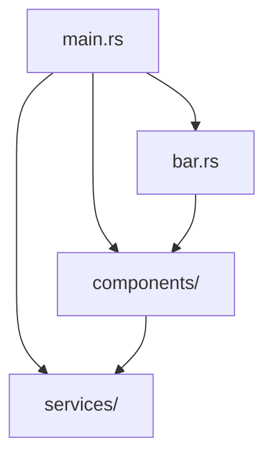

# Developer Rules & Architecture Guidelines (`AGENTS.md`)

This document outlines the codebase layout, module boundaries, development philosophies, and runtime performance constraints of the `cos-niri-bar` shell. Read this carefully before introducing new code or changing existing components.

---

## 1. Project Structure & File Roles

The codebase is organized into modules separated by clear responsibilities:



### Core Program Entry
*   [`src/main.rs`](file:///home/predator/COS_Niri/src/main.rs): Registers font configurations, sets up dynamic CSS hot-reloading, and registers the global `SIGUSR1` signal listener.
*   [`src/bar.rs`](file:///home/predator/COS_Niri/src/bar.rs): Anchors the primary GTK4 window layout onto the Niri compositor surface using `gtk4-layer-shell`.
*   [`src/niri_ipc.rs`](file:///home/predator/COS_Niri/src/niri_ipc.rs): Manages the IPC socket communication interface with the Niri compositor for workspaces, windows, and focus actions.

### Backend Services (`src/services/`)
*   [`mod.rs`](file:///home/predator/COS_Niri/src/services/mod.rs): Registers all background hardware and helper service modules.
*   [`worker.rs`](file:///home/predator/COS_Niri/src/services/worker.rs): Houses a thread pool worker to execute slow shell commands asynchronously without blocking the GTK rendering thread.
*   [`network.rs`](file:///home/predator/COS_Niri/src/services/network.rs): Handles Wi-Fi scanning, connection profiling, and active state monitoring via `nmcli`.
*   [`theme.rs`](file:///home/predator/COS_Niri/src/services/theme.rs): Quantizes colors from the JPEG wallpaper using stack-allocated hue bins and exports dynamic CSS variables.
*   [`audio.rs`](file:///home/predator/COS_Niri/src/services/audio.rs) & [`brightness.rs`](file:///home/predator/COS_Niri/src/services/brightness.rs): Wrap hardware state setters/getters (sysfs, wpctl).
*   [`battery.rs`](file:///home/predator/COS_Niri/src/services/battery.rs), [`bluetooth.rs`](file:///home/predator/COS_Niri/src/services/bluetooth.rs), [`night_light.rs`](file:///home/predator/COS_Niri/src/services/night_light.rs), [`power_profile.rs`](file:///home/predator/COS_Niri/src/services/power_profile.rs).

### Frontend UI Components (`src/components/`)
*   [`center.rs`](file:///home/predator/COS_Niri/src/components/center.rs): Manages the active workspace pill indicators and the application launcher launcher button.
*   [`launcher.rs`](file:///home/predator/COS_Niri/src/components/launcher.rs): A fullscreen, edge-to-edge Launchpad-style app grid with sorting, search entry focusing, and settings filtering.
*   [`right.rs`](file:///home/predator/COS_Niri/src/components/right.rs): Shows system state status indicators (audio volume, battery, network connection) and updates the clock label.
*   [`quick_settings/`](file:///home/predator/COS_Niri/src/components/quick_settings/): Renders the Quick Settings panel, including the sliders and subpages (`wifi_page.rs`, `audio_page.rs`, `bt_page.rs`).

### Visual Styling
*   [`src/style.css`](file:///home/predator/COS_Niri/src/style.css): Holds all CSS styling. Refers to dynamic theme colors using `@define-color` definitions (e.g. `@primary`, `@surface`) which are hot-reloaded at runtime.

---

## 2. Core Development Philosophies & Rules

All developers and agent assistants must strictly follow these coding principles:

### Rule 1: 0.0% Idle CPU Utilization (No Busy Polling)
*   **No continuous background threads or loop sleeps** (such as checking wallpaper files every 2 seconds).
*   Use event-driven signal handlers (`glib::unix_signal_add_local` for POSIX signals) or D-Bus listeners where possible.
*   If asynchronous polling is required, implement a wide back-off timeout using `glib::timeout_add_local` with a duration of at least `50ms` to avoid hogging the main thread.
*   Merge adjacent subprocess calls (e.g. call `wpctl` once to retrieve volume and muting information together).

### Rule 2: $O(1)$ Space Complexity & Cache-Friendly Algorithms
*   Avoid dynamic heap allocations (`Vec`, `Box`, `String`) in hot code paths.
*   To extract colors or bin statistics, use stack-allocated arrays of flat primitives instead of allocating vectors for each bin:
    ```rust
    #[derive(Clone, Copy, Default)]
    struct Bin { r_sum: u64, count: u64 }
    let mut bins = [Bin::default(); 16]; // Stack allocation only
    ```
*   Deduplicate lists (like scanned Wi-Fi access points) in $O(N)$ space using `HashMap` lookups, rather than running $O(N^2)$ linear vector checks.

### Rule 3: Universal Linux Portability
*   Avoid raw dbus system calls for hardware interfaces where paths or signatures vary by distro version (e.g. Fedora Workstation vs. Arch Linux).
*   Prefer calling universal CLI wrapper tools (like `nmcli` for networking or `wpctl` for audio) to ensure compatibility across all standard distributions.

### Rule 4: Dynamic Hot-Reloading
*   Style rules should refer to variables generated in `colors.css`.
*   Whenever resources or configuration states update (e.g., wallpaper is changed), trigger UI reloads by sending signals (like `SIGUSR1`) instead of spawning persistent watcher daemons.
