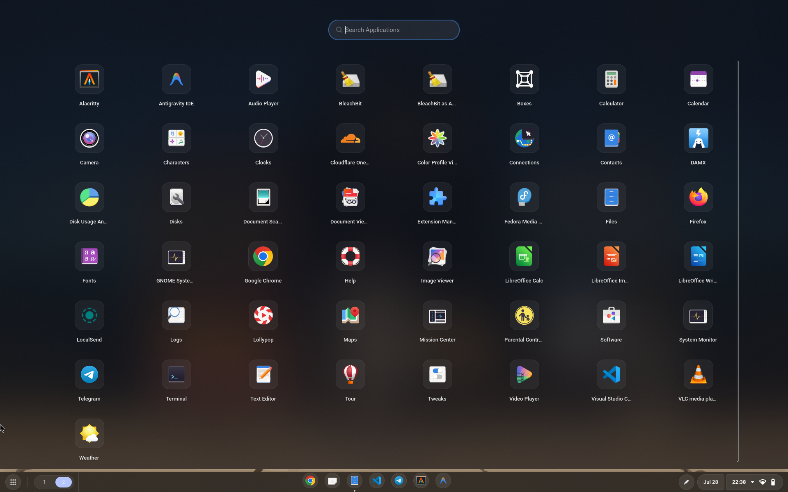
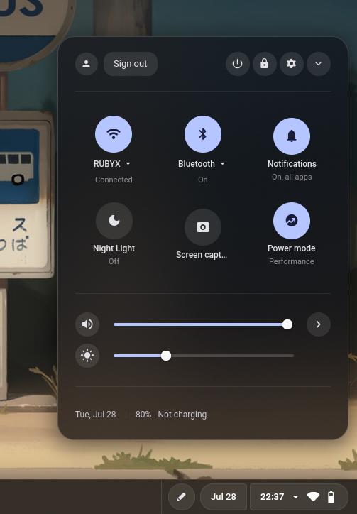
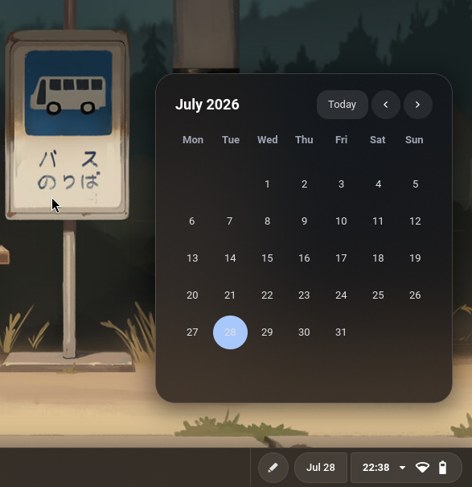
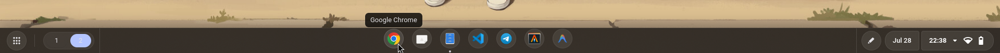
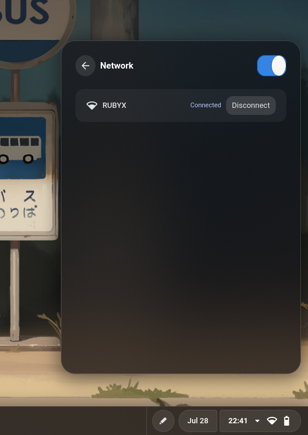
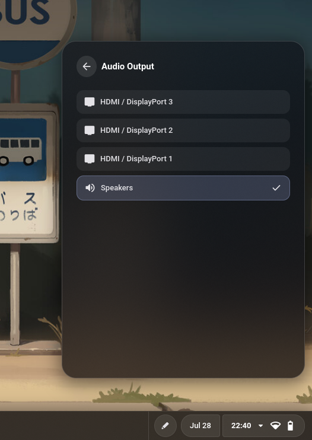

# ChromeOS-Style Niri Bar (`cos-niri-bar`)

A premium, glassmorphic status bar and desktop shell components designed specifically for the Niri Wayland compositor. Styled after ChromeOS and built with GTK4 and Wayland Layer Shell, it features responsive design, zero idle CPU utilization, and deep compositor integration.

---

## Key Features

### 💻 Dynamic Status Bar (Shelf)
* **Unified Status Pill**: Groups tray icons, Wi-Fi, bluetooth, and battery status indicators inside a sleek glassmorphic pill.
* **Smart Pill Auto-Hide**: The system tray container hides itself automatically when no tray clients are active on the bus.
* **Proportional Sizing**: Tray and fallback indicators are sized to match the WiFi/Battery proportions.

### 🌐 System Tray (StatusNotifierWatcher)
* **Compositor Blur & Shadows**: Standalone Wayland layer-shell tray windows (`cos-tray-menu` namespace) allowing Niri to apply native glassmorphism blur and drop-shadow compositor rules.
* **Auto-Dismiss Shield**: A fullscreen, transparent input-grabbing catcher window that dismisses active tray menus when clicking anywhere outside of them.
* **Dynamic Alignment**: Computes layout margins from the icon coordinate `x` and anchors to `Edge::Left` to align the left side of the menu with the clicked icon and expand safely rightwards.
* **Toggle to Close**: Clicking an active icon again toggles the tray menu closed.
* **Universal Icon Loader**: Parses absolute file path notifier icons (e.g. Cloudflare Warp pngs) and loads them via `gtk4::Image::from_file`, falling back to icon theme name resolutions.
* **Menu Sensitivity**: Reads and honors item sensitivity flags to correctly render inactive options and headers.

### 🎛️ Quick Settings Control Center
* **Feature Grid**: Toggles for Wi-Fi, Bluetooth, Night Light, and Power Profile.
* **Power Mode Profiles**: Toggle between Performance (`ea0b`), Balanced (`fff37`), and Battery Saver (`ec1a`) modes, featuring Google Fonts Material Symbols.
* **Live Audio Device Switcher**: Real-time listing of active audio sinks (headphones, speakers, HDMI, etc.) with hot-switching support.
* **Live Wi-Fi Manager**: Real-time network scanning and connection list. Clicking a locked connection displays a password input row with dynamic focus, validation, and visual alerts.
* **Live Bluetooth Manager**: Dynamic list of known and active devices with Connect/Disconnect action buttons. Displays `"Connecting..."` / `"Disconnecting..."` feedback states and disables buttons during network handshake.
* **Interactive Sliders**: Smooth volume and brightness control.
* **Header Actions**: Desktop lock (`loginctl lock-session`), shutdown (`systemctl poweroff`), system settings launch (`gnome-control-center`), and panel collapse button.

### 📅 Calendar & Notifications Panel
* **ChromeOS Grid**: Desktop-integrated date and calendar panel with month traversal chevrons.
* **Dismiss Catcher**: Fully integrated with the transparent click catcher shield for quick dismiss on outside tap.

### 🚀 Launchpad-style App Drawer
* **Fullscreen Layout**: Renders an edge-to-edge Launcher Grid with 16:9 responsive columns.
* **Smart Search**: Dynamic input field that automatically grabs focus on open and filters desktop applications.
* **Universal Icon Resolutions**: Dynamically reads parsed `.desktop` files `Icon=` entries to display correct icons for both Flatpak sandboxes and native DNF package manager installations.

### 🎨 Matugen-powered Dynamic Themes
* **Automatic Theme Generation**: Spawns `matugen` CLI in the background to extract Material Design color systems from the active desktop wallpaper.
* **Glassmorphism Preservation**: Translates solid hex values into translucent `rgba(...)` definitions for background shelves and outlines.
* **Synchronized Desktop Look**: Generates `colors-niri.kdl` for Niri borders and `fuzzel-colors.ini` for the Fuzzel launcher automatically alongside `colors.css`.
* **Zero Loop Event Signaling**: Decouples processes using POSIX signals:
  * **SIGUSR1 (10)**: Tells the bar to trigger `matugen` color regeneration in the background.
  * **SIGUSR2 (12)**: Tells the main GTK thread to reload and hot-reload all CSS styles instantly.

---

## Compatibility & Distro Portability
This shell supports **all major Linux distributions** running NetworkManager (tested on Fedora, Arch Linux, Ubuntu, and Debian).
* **Portable CLI Wrappers**: Rather than calling raw D-Bus methods (which vary by system/distro versions), the shell wraps standard tools (`nmcli`, `bluetoothctl`, `wpctl`, `powerprofilesctl`).
* **Line-buffered stdout tracking**: Commands like `bluetoothctl` are run under `stdbuf -oL` to force line-buffering, guaranteeing connection changes are flushed immediately into the GTK event queue.

---

## Resource Consumption
* **CPU (Idle)**: **0.0%** (zero busy polling; fully event-driven using D-Bus events, `pactl subscribe`, and line-buffered stdout pipes).
* **Resident RAM (RSS)**: **~144 MB**
* **Shared Memory (SHR)**: **~74 MB**

---

## Installation & Build Instructions

### 1. Prerequisites
Ensure you have the required GTK4 libraries and Layer-Shell development packages installed:
```bash
# Fedora
sudo dnf install gtk4-devel gtk4-layer-shell-devel
# Arch Linux
sudo pacman -S gtk4 gtk4-layer-shell
```

### 2. Build Release Binary
Compile the optimized release target:
```bash
cargo build --release
```

### 3. Run Bar on Startup
Configure Niri to spawn it automatically in `~/.config/niri/config.kdl` (or `rules.kdl`):
```kdl
spawn-at-startup "cos-niri-bar"
```

---

## Niri Compositor Window Rules (`rules.kdl`)
Add the following window rules to your Niri configuration (`rules.kdl`) to enable background blur and premium glassmorphic styling:

```kdl
// ChromeOS Bar — blur + shadow for glass shelf effect
layer-rule {
    match namespace="cos-bar"
    shadow {
        on
    }
    background-effect {
        blur true
        xray false
        noise 0.03
        saturation 1.6
    }
}

// ChromeOS Calendar Popup — blur + shadow + rounded corners
layer-rule {
    match namespace="cos-calendar"
    geometry-corner-radius 24
    shadow {
        on
    }
    background-effect {
        blur true
        xray false
        noise 0.03
        saturation 1.6
    }
}

// ChromeOS Quick Settings Popup — blur + shadow + rounded corners
layer-rule {
    match namespace="cos-quick-settings"
    geometry-corner-radius 24
    shadow {
        on
    }
    background-effect {
        blur true
        xray false
        noise 0.03
        saturation 1.6
    }
}

// ChromeOS Tray Popups
layer-rule {
    match namespace="cos-tray-menu"
    geometry-corner-radius 16
    shadow {
        on
    }
    background-effect {
        blur true
        xray false
        noise 0.03
        saturation 1.6
    }
}

// ChromeOS App Launcher Popup (Fullscreen App Drawer)
layer-rule {
    match namespace="cos-launcher"
    geometry-corner-radius 0
    shadow {
        off
    }
    background-effect {
        blur true
        noise 0.03
        saturation 1.6
    }
}
```

---

## Nautilus Integration
Add a Nautilus script to `~/.local/share/nautilus/scripts/Set as Wallpaper` to automatically trigger matugen and update your desktop theme:
```bash
#!/usr/bin/env bash
SELECTED_FILE="${1:-$NAUTILUS_SCRIPT_SELECTED_FILE_PATHS}"
SELECTED_FILE=$(echo "$SELECTED_FILE" | head -n 1)

if [ -f "$SELECTED_FILE" ]; then
    cp "$SELECTED_FILE" "$HOME/.config/background"
    pkill swaybg
    nohup swaybg -i "$HOME/.config/background" -m fill >/dev/null 2>&1 &
    
    # Trigger theme generation on cos-niri-bar
    pkill -USR1 cos-niri-bar || true
fi
```

---

## Screenshots

| macOS Launchpad App Drawer | Quick Settings Control Center |
| :---: | :---: |
|  |  |

| Calendar Panel | Status Bar |
| :---: | :---: |
|  |  |

| WiFi Connections | Audio Output Select |
| :---: | :---: |
|  |  |
