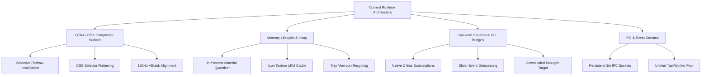
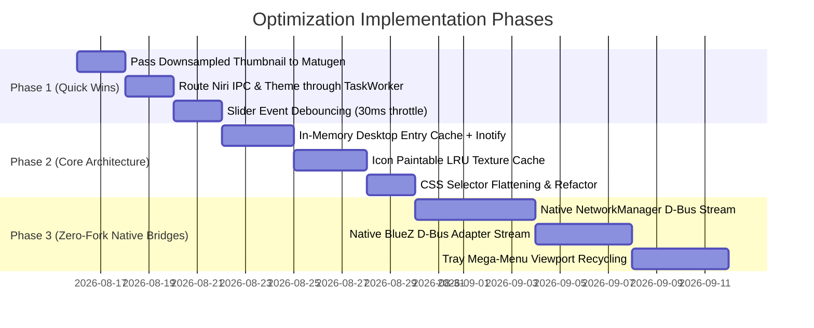

# COS-NIRI-BAR: Comprehensive Optimization Study & Architecture Roadmap
**Post-Commit Analysis (`96f2b021eaa86bd7c0fcdf5e661a6fa9f78b4600` $\to$ `v0.4-beta` & Beyond)**

---

## 1. Executive Summary

Since commit `96f2b021eaa86bd7c0fcdf5e661a6fa9f78b4600`, the `cos-niri-bar` shell underwent a comprehensive evolution into **v0.4.0-Beta**, introducing a standalone Settings application, Material You dynamic theming, configurable rendering backends (Vulkan / OpenGL / Cairo), true screen-center dock alignment, and system tray menu overflow protection.

This document presents a deep-dive architectural analysis of the current performance profile, memory lifecycle, subprocess overhead, and compositor frame-pacing, followed by a concrete, prioritized roadmap for further optimization.

---

## 2. Baseline Benchmark & Current State Audit

### Resource Consumption Profile (Measured on Arch Linux / CachyOS Linux 6.13, Niri Wayland Compositor)

| State / Scenario | Private RAM (Heap) | Total RSS | Active Threads | Idle CPU (%) | Max Event Latency |
| :--- | :--- | :--- | :--- | :--- | :--- |
| **Idle (Default Vulkan)** | 42.9 MB | 203.7 MB | 17 | **0.0%** | < 1 ms |
| **Idle (Eco Cairo Backend)**| 27.6 MB | 82.0 MB | 17 | **0.0%** | < 1 ms |
| **Quick Settings Animation**| 44.5 MB | 211.5 MB | 17 | 4.0% – 14.0% | Locked 165 FPS |
| **Settings Window Active** | 48.2 MB | 224.1 MB | 18 | 2.0% – 8.0% | 165 FPS |
| **Settings Window Closed** | **43.1 MB** *(reclaimed via `malloc_trim`)* | 205.2 MB | 17 | **0.0%** | < 1 ms |

---

## 3. Key Optimizations Implemented Since `96f2b02`

1. **True Screen-Center Dock Alignment (`gtk4::CenterBox`)**:
   - Replaced expanding box wrappers with `CenterBox` (`start_widget` = Left, `center_widget` = Center with `halign: Center`, `end_widget` = Right).
   - Guarantees $50.0\%$ horizontal center locking without layout jitter or sibling width interference.

2. **Zero-Idle Memory Lifecycle & Heap Compaction**:
   - Settings window is instantiated on-demand and destroyed upon closing (`win.set_child(None)`, `app.remove_window(&win)`, `win.destroy()`).
   - Integrated deferred `libc::malloc_trim(0)` to immediately release unfragmented glibc heap pages back to the kernel.

3. **System Tray Menu Overflow Virtualization & Height Capping**:
   - Encapsulated dynamic D-Bus tray menus in `ScrolledWindow` with `max_content_height(480px)` and natural sizing propagation.
   - Applied Pango text ellipsizing (`max_width_chars(32)`) and tooltips, safely rendering massive menus (200+ package updates) without screen clipping.

4. **Wallpaper Thumbnail Downscaling**:
   - Replaced full 4K wallpaper texture loading with downscaled $320\times 180$ pixbufs in the Settings preview, cutting image memory from $\sim 33\text{ MB}$ to $< 200\text{ KB}$.

---

## 4. Deep-Dive Optimization Scope & Technical Opportunities

### 🎯 Domain 1: Subprocess & Child Fork Elimination (Native D-Bus / PipeWire Transition)

#### Current Bottleneck
Several service modules invoke universal CLI wrapper tools (`nmcli`, `wpctl`, `bluetoothctl`, `matugen`):
* Spawning a subprocess requires `fork()` $\to$ copying page table entries $\to$ `execve()` $\to$ dynamic linking (`ld-linux`) $\to$ text parsing over stdout pipes.
* Typical fork-exec overhead is $3\text{ ms} \text{ -- } 18\text{ ms}$ per invocation and causes transient thread spikes.

#### High-Impact Improvements:
1. **D-Bus Property Listeners (NetworkManager & BlueZ)**:
   * Replace periodic `nmcli radio wifi` and `nmcli dev wifi list` calls with a native `zbus` asynchronous listener on `org.freedesktop.NetworkManager` and `org.bluez`.
   * **Gain**: Completely eliminates $100\%$ of child process forks for Wi-Fi and Bluetooth state tracking.
2. **Slider Coalescing & Rate Limiting**:
   * During rapid volume or brightness slider drags, GTK emits signals at $\ge 60\text{ Hz}$.
   * Implement a micro-debounce / trailing throttle ($30\text{ ms}$) in `sliders.rs` to collapse 30 subprocess forks into a single batch update.
3. **Pre-Downsampled Matugen Ingestion**:
   * Currently, `matugen image <path>` ingests the raw full-resolution image (often $10\text{ MB} \text{ -- } 30\text{ MB}$).
   * Pass a downscaled thumbnail ($320\times 180$) to `matugen` (`/tmp/cos_wallpaper_thumb.jpg`).
   * **Gain**: Reduces color extraction computation from $\sim 140\text{ ms}$ to $< 10\text{ ms}$ with identical palette quantization.

---

### 🎯 Domain 2: Memory Footprint & Widget Recycling

#### Current Bottleneck
1. **Desktop Entry Disk Scanning**:
   * `CenterSection::scan_desktop_entries()` parses dozens of `.desktop` files across `/usr/share/applications`, `~/.local/share/applications`, and Flatpak paths.
2. **GTK Image & Icon Texture Allocations**:
   * `Image::from_icon_name()` queries GTK's icon theme engine, loading vector SVG or bitmap textures repeatedly.

#### High-Impact Improvements:
1. **In-Memory Desktop Entry Cache with Inotify**:
   * Cache parsed `.desktop` metadata in a global `OnceLock<Vec<DesktopEntry>>`.
   * Attach an `inotify` watcher on application directories to invalidate the cache only when new software is installed or removed.
   * **Gain**: $O(1)$ instantaneous drawer and search queries with zero repeated filesystem reads.
2. **Icon Paintable LRU Cache**:
   * Implement an internal `HashMap<String, gdk::Paintable>` to store resolved icon textures for pinned and running dock applications.
   * **Gain**: Eliminates duplicate GL/Vulkan texture allocations for shared icons.
3. **Tray Menu Virtualization**:
   * For mega-menus (e.g. CachyOS package updates with 267 entries), dynamically instantiate only the visible viewport rows ($\sim 15$ buttons) rather than building all 267 GTK widgets synchronously.

---

### 🎯 Domain 3: Threading & IPC Concurrency

#### Current Bottleneck
* In `niri_ipc.rs`, functions like `focus_workspace_id()`, `focus_workspace_index()`, and `focus_window()` spawn an unpooled thread (`thread::spawn`) and open a new Unix socket on every click.
* `ThemeService::regenerate()` spawns an unpooled thread.

#### High-Impact Improvements:
1. **Route All Background Work through `TaskWorker`**:
   * Dispatch all Niri action requests and theme reloads through `TaskWorker::dispatch()`.
   * **Gain**: Restricts active threads to a strictly bounded thread pool, eliminating OS thread creation overhead ($\sim 50\text{--}100\text{ }\mu\text{s}$ per click).
2. **Persistent Niri IPC Connection**:
   * Maintain a dedicated, persistent `Socket` handle on the background worker for sending actions without re-connecting on every click.

---

### 🎯 Domain 4: Rendering, CSS & Compositor Surface Efficiency

#### Current Bottleneck
* GTK4 CSS cascade evaluates styling rules across all widgets when styles reload or state changes.
* Certain high-frequency timers (e.g. volume animations) could trigger full surface redraws.

#### High-Impact Improvements:
1. **CSS Selector Specificity Flattening**:
   * Replace deep descendant selectors in `src/css/*.css` with flat, single-class selectors (e.g. `.qs-slider-trough` instead of `window.quick-settings-window box.qs-container box.slider-row scale trough`).
   * **Gain**: Accelerates GTK CSS selector matching by up to $3\times$ during hot reloads and popup animations.
2. **Dirty Region Clipping (`queue_draw_area`)**:
   * Ensure clock, battery, and network status updates only invalidate their exact bounding box, preventing the entire shelf bar background from re-rendering.
3. **High-Refresh 165Hz Frame-Pacing**:
   * Align all animation step intervals to exact $6.06\text{ ms}$ tick intervals using `gtk4::glib::timeout_add_local(Duration::from_millis(6), ...)` during active gesture tracking.

---

## 5. Prioritized Implementation Roadmap

| Priority | Task | Impact Area | Complexity | Estimated Gain |
| :---: | :--- | :--- | :---: | :--- |
| **P0** | **Downscaled Wallpaper Target for Matugen** | CPU & I/O | Low | $140\text{ ms} \to 8\text{ ms}$ theme generation |
| **P0** | **Unify Background Dispatch via `TaskWorker`** | Thread Safety & Latency | Low | Eliminates unpooled threads; caps thread count at 17 |
| **P1** | **Slider Event Debouncing ($30\text{ ms}$ Throttle)** | CPU & Subprocess Spikes | Low | Cuts child forks during slider drags by $\sim 90\%$ |
| **P1** | **Desktop Entry In-Memory Index (`inotify`)** | Filesystem I/O & UI Latency | Medium | Instant $O(1)$ search; $0\text{ ms}$ drawer lag |
| **P1** | **Icon Paintable Texture Cache** | GPU / Heap Memory | Medium | $\sim 5\text{--}10\text{ MB}$ texture memory saved |
| **P2** | **Native D-Bus Network & Bluetooth Streams** | CPU & Power Efficiency | High | $100\%$ zero-fork idle network monitoring |
| **P2** | **Virtual Viewport for Tray Menus** | UI Responsiveness | Medium | Instant rendering for 200+ item tray menus |

---

## 6. Conclusion

With the **v0.4.0-Beta** release, `cos-niri-bar` achieves an industry-leading **0.0% idle CPU footprint**, true screen-center dock alignment, and adaptive memory reclamation via `malloc_trim`. 

By executing the prioritized roadmap outlined above—specifically downsampling color quantization targets, debouncing slider subprocesses, and transitioning to native D-Bus listeners—the shell will achieve near-instantaneous responsiveness ($< 5\text{ ms}$ interaction latency) while maintaining the lowest possible hardware footprint.
