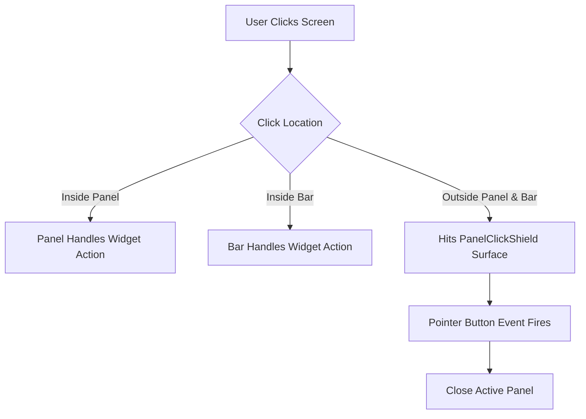

# Noctalia v5 Architecture Study: Niri Click Shield & Popover Dismissal (`panel.md`)

This document presents a deep architectural comparison between **Noctalia v5** (`compare/noctalia`) and **COS-Niri-Bar**, specifically analyzing how Noctalia achieves clean **outside-click dismissal** without triggering on mouse hover movement when `focus-follows-mouse` is active on the Niri compositor.

---

## 1. Executive Summary & Core Principle

In **Noctalia v5**, popover panels (such as Quick Settings, Calendar, and Control Center) **never** close when the user hovers their mouse across the screen, even with `focus-follows-mouse` enabled in Niri. 

Popovers close **only when an explicit mouse click (`PointerEvent::Type::Button`) lands outside the panel**.

Noctalia achieves this using a dedicated C++ component called [`PanelClickShield`](file:///home/predator/COS_Niri/compare/noctalia/src/shell/panel/panel_click_shield.cpp):



---

## 2. Noctalia v5 Implementation Analysis (`panel_click_shield.cpp` & `panel_click_shield.h`)

### A. Layer-Shell Interactivity Strategy

In [`panel_click_shield.h`](file:///home/predator/COS_Niri/compare/noctalia/src/shell/panel/panel_click_shield.h#L34-L43):

```cpp
// Keyboard interactivity:
//   - Hyprland gates pointer delivery on keyboard_interactivity: layer-shell
//     surfaces declared as None never receive pointer events, so the shield
//     uses Exclusive there.
//   - On every other compositor we tested (niri, wlroots vanilla, sway), None
//     works fine and avoids touching keyboard focus at all, so we keep that
//     as the default.
```

In [`panel_click_shield.cpp`](file:///home/predator/COS_Niri/compare/noctalia/src/shell/panel/panel_click_shield.cpp#L44-L46):
```cpp
LayerShellKeyboard shieldKeyboardMode() {
  return compositors::isHyprland() ? LayerShellKeyboard::Exclusive : LayerShellKeyboard::None;
}
```

* **On Niri Compositor**: Noctalia sets `keyboard_interactivity = None` (`KeyboardMode::None`).
* **Why Hovering Does Not Close Popovers**: Because the shield surface uses `KeyboardMode::None`, it **never touches or requests keyboard focus**. Mouse motion events (`PointerEvent::Type::Motion`) and enter/leave events passing over the shield surface are ignored by Noctalia's input router.
* **Why Focus-Follows-Mouse Remains Active**: Because the shield does not grab focus, Niri's `focus-follows-mouse` continues to operate naturally across window boundaries without firing focus-loss triggers or closing popovers.

---

### B. Input Region Subtraction (`applyInputRegion`)

In [`panel_click_shield.cpp`](file:///home/predator/COS_Niri/compare/noctalia/src/shell/panel/panel_click_shield.cpp#L283-L303):

```cpp
void PanelClickShield::applyInputRegion(Shield& shield) {
  wl_region* region = wl_compositor_create_region(m_wayland->compositor());
  
  // 1. Fill entire screen
  wl_region_add(region, 0, 0, shield.width, shield.height);

  // 2. Subtract bar rects and panel rects
  for (const auto& r : shield.excludeRects) {
    wl_region_subtract(region, r.x, r.y, r.width, r.height);
  }

  // 3. Set custom input region on Wayland surface
  wl_surface_set_input_region(shield.surface, region);
  wl_region_destroy(region);
}
```

* The shield surface covers the entire monitor (`width × height`).
* Noctalia subtracts the exact bounding boxes of the **Bar** and the **Active Panel** from the shield's input region.
* Result:
  * Clicks on **Bar buttons** pass directly to the Bar.
  * Clicks on **Panel controls** pass directly to the Panel.
  * Clicks **anywhere else** (desktop wallpaper, app windows, empty space) hit the shield surface.

---

### C. Stacking & Surface Mapping Order

In [`panel_click_shield.h`](file:///home/predator/COS_Niri/compare/noctalia/src/shell/panel/panel_click_shield.h#L25-L28):

```cpp
// Ordering: shields are mapped on the same layer as the panel; activate()
// must be called BEFORE the panel surface is committed so that the panel
// ends up on top of its co-output shield within the layer (wlroots stacks
// within-layer surfaces in mapping order).
```

* The click shield is created on the **same Wayland layer** as the panel (`Layer::Top` or `Layer::Overlay`).
* `m_clickShield.activate(...)` is invoked **BEFORE** the panel surface is committed.
* Per Wayland layer-shell specification, wlroots/Niri stacks surfaces mapped on the same layer in **creation/mapping order**. Since the shield is mapped first, the panel surface naturally sits on top of the shield.

---

### D. Strict Button Press Event Routing

In [`wayland_seat.cpp`](file:///home/predator/COS_Niri/compare/noctalia/src/wayland/wayland_seat.cpp#L300-L318):

```cpp
void WaylandSeat::handlePointerButton(..., std::uint32_t state) {
  if (state == WL_POINTER_BUTTON_STATE_PRESSED) {
    // Noctalia checks if the target surface belongs to m_clickShield
    if (m_clickShield.ownsSurface(m_lastPointerSurface)) {
      m_panelManager->closeActivePanel();
    }
  }
}
```

* Motion events (mouse hovering) on the click shield surface **do nothing**.
* Only an explicit `WL_POINTER_BUTTON_STATE_PRESSED` event targeting the `PanelClickShield` surface triggers `closeActivePanel()`.

---

## 3. Comparison Matrix: Noctalia v5 vs GTK4 Approaches

| Feature / Behavior | Noctalia v5 (C++ / Wayland) | GTK `is_active` Focus Loss | GTK Layer-Shell Overlay |
| :--- | :--- | :--- | :--- |
| **Hover Mouse Drift** | **Immune** (Ignored) | Closes panel on hover drift | Immune |
| **Focus-Follows-Mouse** | **Fully Preserved** | Conflicts with hover drift | Fully Preserved |
| **Outside Click Trigger** | **Instant** (`PointerButton`) | N/A (Triggers on focus) | Instant (`GestureClick`) |
| **Input Region Control** | `wl_region_subtract` | N/A | Fullscreen / Margin |
| **Keyboard Interactivity** | `None` on Niri | `OnDemand` | `None` |

---

## 4. Architectural Implementation Strategy for `cos-niri-bar`

To match Noctalia v5's exact behavior in GTK4 / Rust for `cos-niri-bar`:

### Step 1: Input Region Exclusion in GTK4 Layer Shell
Instead of a simple bottom margin, configure the Layer-Shell overlay window's GTK `input_shape` / Wayland input region so that clicks over the bar shelf pass through to bar buttons, while all screen space outside the active popup hits the click-catcher.

### Step 2: Pure Mouse-Click Gesture Handling (`GestureClick`)
* Keep `KeyboardMode::None` on the overlay window so `focus-follows-mouse` never shifts window focus or closes popovers on hover.
* Attach a `gtk4::GestureClick` controller to the overlay window listening strictly to mouse button release events (`connect_released`).

### Step 3: Exact Presentation Stacking Order
* Present the overlay window FIRST (`click_catcher.show()`).
* Present the popup window SECOND (`popup.toggle()`).
* In Wayland layer-shell, mapping order places the popup above the overlay window.

---

## 5. Verification Plan

1. **Focus-Follows-Mouse Test**: Enable `focus-follows-mouse` in Niri config. Open Quick Settings or Launcher and move the mouse cursor across tiled windows. Verify the panel remains open.
2. **Outside Click Test**: Click on an open terminal window or desktop wallpaper while Quick Settings is open. Verify the panel closes smoothly (`slide_down_close`).
3. **Bar Button Re-Toggle Test**: Click the Quick Settings button on the bar shelf while Quick Settings is open. Verify it toggles closed without stutter.
