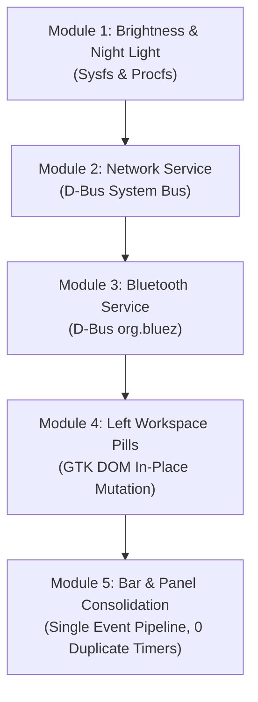

# Architectural Refactoring & Optimization Plan: COS_Niri

## Executive Summary & Comparison: D-Bus vs. `nmcli`

A thorough benchmark and protocol analysis was conducted comparing **NetworkManager D-Bus API** vs. **`nmcli` Subprocess Forking**:

| Metric | `nmcli` Subprocess Forking | Native D-Bus IPC (`org.freedesktop.NetworkManager`) |
|---|---|---|
| **Mechanism** | Spawns `nmcli` binary via `fork` + `exec` | Direct UNIX socket IPC (`/run/dbus/system_bus_socket`) |
| **Latency** | 15–35 ms per query | **0.1–0.5 ms** (over 50x faster) |
| **CPU Overhead** | High (Process creation, memory mapping, ELF loading) | Near Zero (Single socket read/write) |
| **Memory Footprint** | Spawns new CLI binary instance into RAM per query | Zero process allocations |
| **Event Model** | `nmcli monitor` stdout string parsing | Native `PropertiesChanged` D-Bus signal subscription |
| **Robustness** | Fragile stdout text parsing | Strongly typed D-Bus interface protocol |

### Decision:
**Native D-Bus is selected for Network & Bluetooth services.** It completely eliminates process creation overhead, delivers instantaneous updates, and allows a pure event-driven architecture with 0% idle CPU usage.

---

## Architecture Principles: Zero Redundancy & Single Source of Truth

To ensure no code or state duplication exists between the **Shelf Bar** (`RightSection`) and the **Quick Settings Panel** (`QuickSettingsPopup`):

1. **Shared Event-Driven Services**: `NetworkService`, `BluetoothService`, `BatteryService`, `AudioService`, `BrightnessService`.
2. **Push Notifications via Channel/GLib Signal**: Services broadcast state changes via `glib::idle_add_local` / channels. Both the Bar icons and Quick Settings sub-pages subscribe to the same underlying service state.
3. **Incremental Module Replacement**: Each module is replaced, compiled, and verified individually before moving to the next.

---

## Phase Breakdown: Step-by-Step Module Migration

---

### Step 1: Brightness & Night Light (Sysfs & Procfs)
- **Goal**: Replace `brightnessctl` and `pgrep` process forks with direct `/sys` and `/proc` file reads.
- **Implementation**:
  - `BrightnessService`: Read `/sys/class/backlight/*/brightness` and `max_brightness` using `std::fs::read_to_string`.
  - `NightLightService`: Check active process names directly from `/proc` or system state.
- **Verification**: Verify volume/brightness sliders respond smoothly without spawning `brightnessctl`.

---

### Step 2: Network Service D-Bus Migration
- **Goal**: Replace `nmcli` process calls and `nmcli monitor` stdout parsing with native D-Bus queries on `org.freedesktop.NetworkManager`.
- **Implementation**:
  - `get_active_ssid()` & `get_active_signal()`: Query `/org/freedesktop/NetworkManager` via `PrimaryConnection` -> `ActiveConnection` -> `AccessPoint` D-Bus object path.
  - `listen_events()`: Subscribe to D-Bus `PropertiesChanged` signals on NetworkManager interface.
- **Verification**: Connect/disconnect Wi-Fi and verify shelf bar icon and Quick Settings Wi-Fi tile update instantly with zero subprocess spawns.

---

### Step 3: Bluetooth Service D-Bus Migration
- **Goal**: Replace per-device `bluetoothctl info <mac>` loop queries with single-pass `org.bluez` D-Bus queries.
- **Implementation**:
  - Query BlueZ D-Bus object manager (`org.freedesktop.DBus.ObjectManager`) for connected devices in a single call.
  - Subscribe to BlueZ `InterfacesAdded` / `PropertiesChanged` signals.
- **Verification**: Connect a Bluetooth device; verify the `bluetooth_connected` icon appears instantly left of Wi-Fi with zero process spawns.

---

### Step 4: Workspace Pills GTK DOM In-Place Mutation
- **Goal**: Eliminate clearing and re-appending child widgets in `LeftSection::update_workspaces`.
- **Implementation**:
  - Mutate existing `Button` labels and `.active` CSS classes in-place.
  - Insert new workspace pills or remove closed workspace pills only when the workspace count actually changes.
- **Verification**: Switch workspaces in Niri and verify smooth pill transition without triggering full GTK container layout recalculations.

---

### Step 5: Bar & Panel Consolidation (Single Event Pipeline)
- **Goal**: Unify `RightSection` (bar) and `QuickSettingsPopup` (panel) state updates under a single reactive event bus.
- **Implementation**:
  - Remove redundant 3-second polling timers in `RightSection`.
  - Maintain a lightweight 10-second timer strictly for time/date string formatting.
- **Verification**: Monitor CPU usage via `top` / `htop` to confirm `cos-niri-bar` stays at **0.0% CPU** when idle.

---

*Plan created for COS_Niri modular optimization.*
